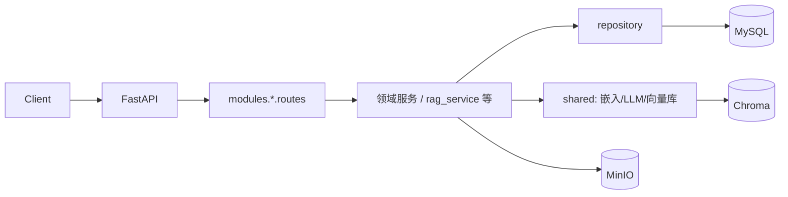

# RAG Engine 后端项目架构说明

本文档描述当前仓库 **后端**（`backend/`）的目录划分、分层约定与运行时行为，与实现保持同步。若与 `docs/总览/` 下较早文档冲突，**以本文件与源码为准**。

---

## 1. 技术栈摘要

| 类别 | 选型 | 说明 |
|------|------|------|
| Web | FastAPI | REST + OpenAPI（Swagger `/docs`） |
| 配置 | pydantic-settings | `.env` 与类型安全配置 |
| 关系库 | MySQL + SQLAlchemy 2.x + Alembic | 业务数据与迁移 |
| 向量库 | Chroma（HTTP 客户端） | MVP 仅 Chroma，集合名一般为 `kb_{知识库ID}` |
| 对象存储 | MinIO | 原始文档对象 |
| RAG 运行时 | LangChain 1.x + 用户配置的 LLM/嵌入 | 密钥与模型名存于「模型配置」表 |
| 评估（可选） | RAGAS | 任务异步执行与指标落库 |

运行环境建议使用 Conda：`backend/environment.yml`（环境名 `p311`，Python 3.11）。

---

## 2. 分层与目录约定

```
backend/app/
├── main.py                 # FastAPI 入口：lifespan（MinIO + Alembic）、CORS、全局异常
├── core/                   # 横切：config、security、exceptions、minio
├── db/                     # SQLAlchemy Session / engine
├── models/                 # ORM 模型（集中放置，便于 Alembic 发现）
├── schemas/                # Pydantic 请求/响应模型（API 契约）
├── api/                    # HTTP 横切：deps、errors；api_v1/api.py 仅汇总路由
├── modules/                # 按业务域划分（路由 + 领域服务 + 仓库）
├── shared/                 # 跨域基础设施（嵌入/LLM/向量库/运行时配置）
└── startup/                # 启动时迁移封装
```

### 2.1 `app.modules`（业务域）

| 包路径 | 职责 |
|--------|------|
| `modules/auth` | 注册、登录、JWT；`routes` / `service` / `repository` |
| `modules/knowledge` | 知识库 CRUD、文档上传与处理、检索测试；`routes_knowledge_base` / `routes_documents` 等 |
| `modules/chat` | 对话 CRUD、SSE 流式 RAG；`rag_service` 为核心生成逻辑 |
| `modules/evaluation` | 评估任务、用例、RAGAS 执行与结果 |
| `modules/llm_config` | 用户多份 LLM/嵌入配置与激活态 |

**依赖方向**：`modules/*` → `shared/*` → `core` / `db`；避免业务模块互相循环引用（评估、对话等通过知识库 ID 间接关联即可）。

### 2.2 `app.shared`（共享基础设施）

| 路径 | 职责 |
|------|------|
| `shared/embedding` | 嵌入模型工厂（读当前用户运行时配置） |
| `shared/llm` | 聊天模型工厂 |
| `shared/vector_store` | Chroma 向量存储封装与工厂 |
| `shared/ai_runtime_*` | 从 DB 加载当前用户启用模型、上下文令牌 |
| `shared/rag_dedupe` | 检索结果去重 |
| `shared/chunk_record` | 分块持久化辅助 |

### 2.3 `app.models` 与 `app.schemas`

- **models**：单一包存放全部表映射，避免 Alembic 与关系导入分散。
- **schemas**：API 输入输出模型集中管理，与各 `modules` 路由配合使用。

---

## 3. 请求与异常处理



- **认证**：`Authorization: Bearer <JWT>`，依赖 `core.security.get_current_user`。
- **模型配置前置**：部分接口通过 `api.deps.require_active_ai_runtime` 要求用户已启用一套 LLM/嵌入配置。
- **领域异常**：服务层抛出 `core.exceptions.AppServiceError` 子类；`main.py` 注册全局处理器，映射为 JSON `detail`（与 `api.errors.http_exception_from_service` 一致）。

---

## 4. 应用生命周期

- 使用 **lifespan**（非已弃用的 `on_event("startup")`）在启动阶段：
  1. `init_minio()` 确保桶存在；
  2. `DatabaseMigrator` 执行 `alembic upgrade head`。

---

## 5. API 前缀一览

| 前缀 | 说明 |
|------|------|
| `/api/auth` | 注册、登录、Token 校验 |
| `/api/knowledge-base` | 知识库与文档（含上传、处理、检索测试） |
| `/api/chat` | 对话与流式消息 |
| `/api/evaluation` | 评估任务与结果 |
| `/api/llm-configs` | 模型配置 CRUD 与激活 |
| `/api/health` | 健康检查（见 `main.py`） |

OpenAPI JSON：`/api/openapi.json`（Swagger UI 使用，**不是**已移除的第三方 OpenAPI 路由）。

---

## 6. 相关文档

- 业务流程分册见 [`docs/业务流程/00-业务流程总览与索引.md`](../业务流程/00-业务流程总览与索引.md)。
- 历史总览（可能部分表述早于当前实现）：[`docs/总览/00 项目总览.md`](../总览/00%20项目总览.md)。
