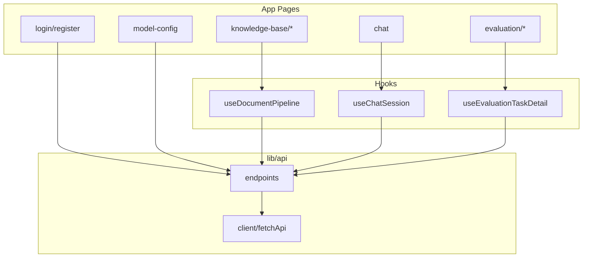

# 前端业务逻辑

下文按**用户任务**组织：页面路径来自 [`PATH`](../src/lib/routes.ts)，接口来自 [`lib/api/endpoints.ts`](../src/lib/api/endpoints.ts)。若与仓库根 `docs/架构/API路由.md` 不一致，**以 `backend/app/modules/**/routes\*.py` 为准\*\*。

---

## 1. 认证

| 页面 | 路径        | 主要操作                                  | 接口                                  |
| ---- | ----------- | ----------------------------------------- | ------------------------------------- |
| 登录 | `/login`    | 提交用户名密码，写入 `localStorage.token` | `POST /api/auth/token`（OAuth2 表单） |
| 注册 | `/register` | 注册后通常再登录                          | `POST /api/auth/register`             |

**逻辑要点**：

- Dashboard [`layout`](../src/app/dashboard/layout.tsx) 无 token 则重定向登录。
- 业务请求由 `fetchApi` 自动带 Bearer；401 时清 token 并跳转登录。

---

## 2. 知识库

| 页面     | 路径                        | 主要操作                                         | 接口（节选）                                                  |
| -------- | --------------------------- | ------------------------------------------------ | ------------------------------------------------------------- |
| 列表     | `/dashboard/knowledge-base` | 列表、进入详情/新建                              | `GET /api/knowledge-base`                                     |
| 新建     | `…/new`                     | 创建                                             | `POST /api/knowledge-base`                                    |
| 详情     | `…/[id]`                    | 上传、预览分块、提交处理、轮询、检索测试、删文档 | 见下「文档流水线」                                            |
| 编辑     | `…/[id]/edit`               | 改名称/描述                                      | `PUT /api/knowledge-base/{id}`                                |
| 文档详情 | `…/[id]/documents/[docId]`  | 单文档信息、**替换文件**（同名覆盖）             | `GET …/documents/{docId}`、`knowledgeBaseApi.replaceDocument` |
| 分块引用详情 | `…/[id]/chunks/[chunkId]` | 展示单条 `document_chunks` 全文与文档链接（对话引用跳转） | `GET /api/knowledge-base/{kbId}/chunks/{chunkId}`（`knowledgeBaseApi.getChunk`） |

### 2.1 文档流水线（详情页核心）

实现集中在 [`useDocumentPipeline`](../src/hooks/useDocumentPipeline.ts)，与界面上的「上传 → 预览 → 处理 → 等待完成」一致：

1. **上传**：`POST /api/knowledge-base/{kbId}/documents/upload`（`FormData`，字段 `files`）。
2. **预览**（可选）：`POST …/documents/preview`，请求体含 `document_ids`（上传返回的 `upload_id`）及可选 `chunk_size` / `chunk_overlap`。
3. **处理**：`POST …/documents/process`，请求体为上传结果数组；响应含 `task_id` 列表。
4. **轮询**：`GET …/documents/tasks?task_ids=…`（逗号分隔），约 3s 一次；同时 `fetchKb` 刷新详情，使文档列表与 `processing_tasks` 更新。
5. **刷新进入**：若详情中带 `pending_upload_tasks`，将其中 `task_id` 并入轮询列表，避免刷新后丢失进度。

**其它**：

- **已入库文档替换（同名）**：文档详情页「**替换文件**」按钮 → `knowledgeBaseApi.replaceDocument(kbId, docId, file, { chunk_size, chunk_overlap })` → `POST /api/knowledge-base/{kbId}/documents/{docId}/replace?chunk_size=…&chunk_overlap=…`（`FormData` 字段 **`file`**）。页面上可填写「每块最大字符数 / 块之间重叠字符数」，留空则按默认 1000 / 200（与后端、`form-defaults.ts` 一致）。所选本地文件名须与当前 `file_name` 一致（前后端均会校验）。服务端覆盖 MinIO 后增量更新向量，**同步请求**，大文件可增大 `NEXT_PUBLIC_API_TIMEOUT_MS`。
- **清理临时文件**：`POST /api/knowledge-base/cleanup`（全局）。删除规则见仓库根 `docs/架构/API路由.md` 中 `/cleanup` 一行（无「超过 N 小时」条件）。
- **检索测试**：`POST /api/knowledge-base/test-retrieval`，body：`query`、`kb_id`、`top_k`。
- **删除**：单删 `DELETE …/documents/{docId}`；批量 `POST …/documents/batch-delete`。

---

## 3. 对话（RAG）

| 页面 | 路径              | 主要操作                                      | 接口 |
| ---- | ----------------- | --------------------------------------------- | ---- |
| 对话 | `/dashboard/chat` | 列表、新建、选会话、发消息（流式）、删/批量删 | 见下 |

实现：[`useChatSession`](../src/hooks/useChatSession.ts) + [`chat-stream`](../src/lib/chat-stream.ts)。

1. **列表**：`GET /api/chat?skip=&limit=`。
2. **选中会话**：`GET /api/chat/{id}`，将返回的 `messages` 转为界面消息；助手历史若含 `__LLM_RESPONSE__` 前缀，则解析出正文与引用（与流式增量协议一致）。
3. **新建**：`POST /api/chat`，body：`title`、`knowledge_base_ids`；知识库列表来自 `GET /api/knowledge-base`。
4. **发送消息**：`POST /api/chat/{chatId}/messages`，body：`{ messages, rag_options? }`。`messages` 为**完整历史**，最后一条须为用户；`rag_options` 与后端 `RagPipelineOptions` 一致（Top-K、查询重写、多库合并、混合检索、多路召回、重排、父子块展开等），由对话页 **「RAG 检索选项」** 折叠面板配置（`RagOptionsBar` + `useChatSession` 中的 `DEFAULT_RAG_OPTIONS` / `parseChatRagTopK`，见 `lib/form-defaults.ts`）。不传 `rag_options` 时后端使用默认 Native 向量检索（`top_k=4`）。响应为 **SSE**，按行解析 `data:` JSON，累积 `text` 与引用。
5. **引用详情**：助手消息「参考来源」中，当 `metadata` 含 `kb_id` 与 `chunk_id` 时显示「查看引用详情」，新标签页打开 `PATH.chunkDetail(kbId, chunkId)` 对应页面。
6. **删除**：`DELETE /api/chat/{id}`；批量 `POST /api/chat/batch-delete`，body：`{ chat_ids: number[] }`。

---

## 4. RAG 评估

| 页面 | 路径                    | 主要操作                                        | 接口（节选）                                                         |
| ---- | ----------------------- | ----------------------------------------------- | -------------------------------------------------------------------- |
| 列表 | `/dashboard/evaluation` | 列表、进详情、删除                              | `GET /api/evaluation`、`DELETE /api/evaluation/{id}`（支持 `force`） |
| 新建 | `…/new`                 | 选类型/指标、填用例、创建                       | `GET /api/evaluation/types`、`POST /api/evaluation`                  |
| 详情 | `…/[id]`                | 拉任务、跑评估、刷新状态、看结果、导入 JSON、删 | 见下                                                                 |

详情数据层：[`useEvaluationTaskDetail`](../src/hooks/useEvaluationTaskDetail.ts) + [`evaluation-task-utils`](../src/lib/evaluation-task-utils.ts)。

1. **首屏/刷新任务**：优先 `GET /api/evaluation/resolve/{id}`（无任务时仍 200，`ok: false`），避免刷 404；存在则得到完整 `task`。
2. **结果列表**：`GET /api/evaluation/{id}/results`。
3. **执行**：`POST /api/evaluation/{id}/run`（后台任务；用户点「刷新状态」合并拉任务+结果，**无自动轮询**）。
4. **批量导入用例**：`POST /api/evaluation/{id}/test-cases/import`。
5. **去重与缓存**：同一 `taskId` 的 resolve 请求在 Strict Mode 下合并为单次 in-flight；曾确认不存在的 id 写入 `sessionStorage`，减少重复无效请求。

---

## 5. LLM / 嵌入配置

| 页面     | 路径                      | 主要操作                     | 接口                                                           |
| -------- | ------------------------- | ---------------------------- | -------------------------------------------------------------- |
| 模型配置 | `/dashboard/model-config` | 列表、新建、编辑、激活、删除 | `GET/POST /api/llm-configs`、`PUT/POST activate/DELETE …/{id}` |

配置 JSON 形状与后端 `AiRuntimeSettings` 一致，见类型 [`AiRuntimeSettings`](../src/lib/api/types.ts)。

---

## 6. Dashboard 首页

| 页面 | 路径         | 作用                                                           |
| ---- | ------------ | -------------------------------------------------------------- |
| 首页 | `/dashboard` | 聚合展示知识库/对话/评估等入口与简要统计（具体以页面实现为准） |

---

## 7. 依赖关系简图

以上文档描述当前实现的主要闭环；新增页面时请同步更新本文件与 [`README.md`](./README.md) 索引。

---

## 附录：界面实现

各页交互与接口对应关系见上文；**视觉与 Tailwind 语义色**以 [`04-设计系统.md`](./04-设计系统.md) 为准，避免在新页面中重新引入未约定的灰/蓝原子类。
